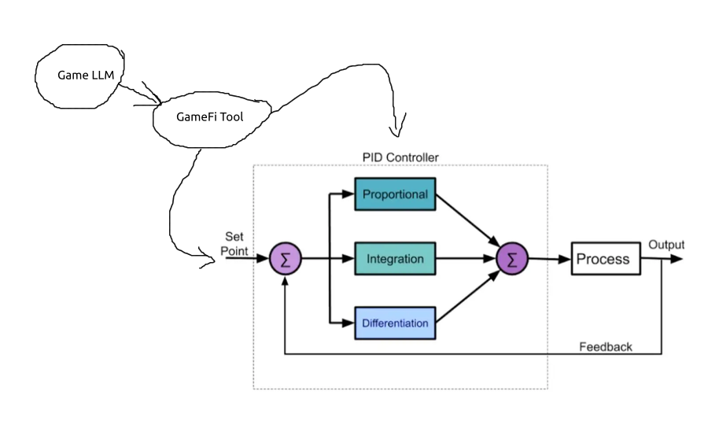

# Automated Market Making (AMM) Tool for Large Language Models (LLMs)

## Proportional Integral and Derivative Market Maker (PIDMM)
Proportional Integral and Derivative Market Maker (PIDMM) is a new automated market making (AMM) system, developed by SugarFunge, that utilizes control theory to dynamically adjust the pricing of assets in a decentralized market. The goal of our PIDMM system is to balance the supply and demand of assets in the market, ensuring that the market remains stable and liquid.

Here's how the three components of our PIDMM system work:
- *Proportional Control*: The proportional component of the PIDMM system adjusts the price of an asset in response to changes in the supply and demand of that asset. For example, if there is high demand for a particular asset, the PIDMM system will increase the price of that asset to reduce demand and encourage more supply. Conversely, if there is high supply of a particular asset, the PIDMM system will decrease the price of that asset to encourage more demand and reduce supply.
- *Integral Control*: The integral component of the PIDMM system keeps track of the cumulative errors in the market and adjusts the price of an asset accordingly. For example, if the market has been consistently overvaluing a particular asset, the integral component will gradually decrease the price of that asset over time to bring it back in line with its true value. Similarly, if the market has been consistently undervaluing a particular asset, the integral component will gradually increase the price of that asset over time to bring it back in line with its true value.
- *Derivative Control*: The derivative component of the PIDMM system predicts future changes in the market and adjusts the price of an asset accordingly. For example, if the PIDMM system predicts that there will be a sudden increase in demand for a particular asset (e.g., due to a news announcement), it will proactively increase the price of that asset to prevent a supply shortage and maintain market stability. Similarly, if the PIDMM system predicts that there will be a sudden decrease in demand for a particular asset (e.g., due to a market correction), it will proactively decrease the price of that asset to prevent a surplus and maintain market stability.

In summary, the PIDMM system is a type of automated market making system that utilizes control theory to dynamically adjust the pricing of assets in a decentralized market. By utilizing a combination of proportional, integral, and derivative control, the PIDMM system can ensure that the market remains stable and liquid, promoting an efficient and effective trading experience for all participants.

## Constant Product Market Maker
Constant Product Market Maker (CPMM): This algorithm is used in Automated Market Makers (AMMs) to determine the price of an asset in a liquidity pool. The CPMM maintains a constant product of two assets in a pool, meaning that as one asset is bought, the price of the other asset must decrease to maintain the constant product. Uniswap V2 and Sushiswap are examples of CPMMs.

## Constant Sum Market Maker
Constant Sum Market Maker (CSMM): Similar to the constant product formula, CSMM uses a fixed sum of two assets in a pool, but instead of keeping their product constant, it keeps their sum constant. This means that if one asset is bought, the price of the other asset must increase to maintain the constant sum. An example of a CSMM is a stablecoin pool.